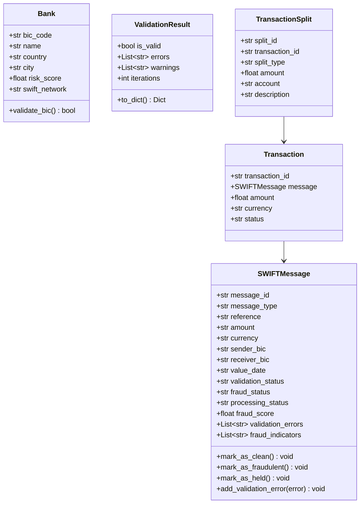

## Class Diagram

### Workflow Demo Class Architecture

```mermaid
classDiagram
    class WorkflowPatternDemo {
        -SWIFTGenerator swift_generator
        -EvaluatorOptimizer evaluator_optimizer
        -ParallelizationAgent parallelization_agent
        -RoutingAgent routing_agent
        -PromptChainingAgent prompt_chaining_agent
        -OrchestratorWorker orchestrator_worker
        +run_demo() void
        -_step_1_message_generation() List~SWIFTMessage~
        -_step_2_evaluator_optimizer(messages) List~SWIFTMessage~
        -_step_3_parallelization_routing(messages) List~SWIFTMessage~
        -_step_4_prompt_chaining(messages) List~SWIFTMessage~
        -_step_5_orchestrator_worker(messages) void
    }

    class SWIFTGenerator {
        -List~Bank~ banks
        -Faker faker
        +generate_messages(count, bank_count) List~SWIFTMessage~
        +generate_banks(count) List~Bank~
        -_generate_single_message() SWIFTMessage
        -_select_random_banks() Tuple
    }

    class EvaluatorOptimizer {
        -int max_iterations
        +process_message(message) SWIFTMessage
        +validate_message(message) ValidationResult
        -_optimize_message(message, errors) SWIFTMessage
        -_validate_bic(bic) bool
        -_validate_amount(amount) bool
        -_validate_date(date) bool
    }

    class ParallelizationAgent {
        -int worker_count
        -int batch_size
        +process_messages_parallel(messages, agent) List~SWIFTMessage~
        -_process_batch(batch, agent) List~SWIFTMessage~
    }

    class RoutingAgent {
        -float fraud_threshold
        +route_message(message) SWIFTMessage
        +calculate_fraud_score(message) float
        -_apply_benfords_law(amount) float
        -_check_fraud_indicators(message) List
        -_route_by_score(message, score) void
    }

    class PromptChainingAgent {
        -LLMService llm_service
        -List~str~ agent_roles
        +batch_process_with_chaining(messages, scores, indicators) List~Dict~
        +process_single_chain(message, score, indicators) Dict
        -_screener_agent(context) str
        -_technical_analyst(context, screener_output) str
        -_risk_assessor(context, previous_outputs) str
        -_compliance_officer(context, previous_outputs) str
        -_final_reviewer(all_outputs) Dict
    }

    class OrchestratorWorker {
        -int worker_count
        -float company_fee_rate
        +process_transactions(messages) void
        -_orchestrate_splits(transactions) List~TransactionSplit~
        -_worker_process_split(transaction) List~TransactionSplit~
        -_calculate_fee(amount) float
    }

    WorkflowPatternDemo --> SWIFTGenerator
    WorkflowPatternDemo --> EvaluatorOptimizer
    WorkflowPatternDemo --> ParallelizationAgent
    WorkflowPatternDemo --> RoutingAgent
    WorkflowPatternDemo --> PromptChainingAgent
    WorkflowPatternDemo --> OrchestratorWorker
```

### Data Models

```mermaid
classDiagram
    class SWIFTMessage {
        +str message_id
        +str message_type
        +str reference
        +str amount
        +str currency
        +str sender_bic
        +str receiver_bic
        +str value_date
        +str validation_status
        +str fraud_status
        +str processing_status
        +float fraud_score
        +List~str~ validation_errors
        +List~str~ fraud_indicators
        +mark_as_clean() void
        +mark_as_fraudulent() void
        +mark_as_held() void
        +add_validation_error(error) void
    }

    class Bank {
        +str bic_code
        +str name
        +str country
        +str city
        +float risk_score
        +str swift_network
        +validate_bic() bool
    }

    class ValidationResult {
        +bool is_valid
        +List~str~ errors
        +List~str~ warnings
        +int iterations
        +to_dict() Dict
    }

    class Transaction {
        +str transaction_id
        +SWIFTMessage message
        +float amount
        +str currency
        +str status
    }

    class TransactionSplit {
        +str split_id
        +str transaction_id
        +str split_type
        +float amount
        +str account
        +str description
    }

    Transaction --> SWIFTMessage
    TransactionSplit --> Transaction
```
