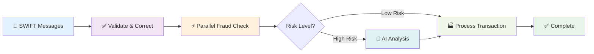
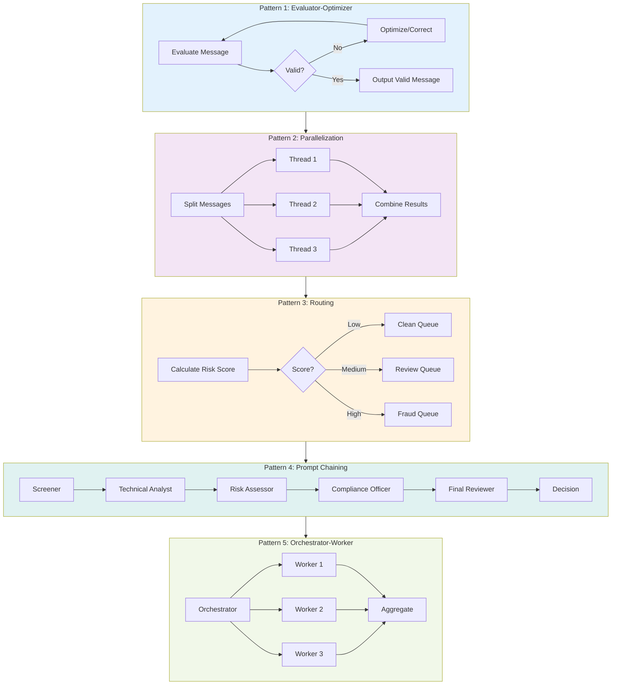

# SWIFT Transaction Workflow Pattern - Flow Diagram

## Complete Workflow Flow

```mermaid
flowchart TD
    Start([Start Workflow]) --> Step1
    
    Step1[📝 Step 1: Message Generation<br/>SWIFTGenerator] --> Gen[Generate 25 SWIFT Messages<br/>MT103 & MT202 Types]
    Gen --> Step2
    
    Step2[✅ Step 2: Evaluator-Optimizer<br/>Validation & Correction] --> Validate{Valid<br/>Message?}
    Validate -->|No| Correct[Apply Corrections<br/>Iterate Until Valid]
    Correct --> Validate
    Validate -->|Yes| Validated[Validated Messages]
    Validated --> Step3
    
    Step3[⚡ Step 3: Parallelization + Routing<br/>Fraud Detection] --> Parallel[Process Messages in Parallel<br/>Multiple Threads]
    Parallel --> Benford[Apply Benford's Law<br/>Calculate Fraud Score]
    Benford --> Route{Fraud<br/>Score?}
    
    Route -->|Low 0.0-0.3| Clean[🟢 CLEAN<br/>Safe for Processing]
    Route -->|Medium 0.3-0.7| Held[🟡 HELD<br/>Review Required]
    Route -->|High 0.7-1.0| Fraud[🔴 FRAUDULENT<br/>Block Transaction]
    
    Clean --> Collect[Collect All Routed Messages]
    Held --> HighRisk{High Risk<br/>Score > 0.3?}
    Fraud --> Collect
    
    HighRisk -->|Yes| Step4[🤖 Step 4: Prompt Chaining<br/>AI Analysis]
    HighRisk -->|No| Collect
    
    Step4 --> Agent1[Agent 1: Screener<br/>Initial Risk Assessment]
    Agent1 --> Agent2[Agent 2: Technical Analyst<br/>Pattern Analysis]
    Agent2 --> Agent3[Agent 3: Risk Assessor<br/>Risk Evaluation]
    Agent3 --> Agent4[Agent 4: Compliance Officer<br/>Regulatory Check]
    Agent4 --> Agent5[Agent 5: Final Reviewer<br/>Final Decision]
    
    Agent5 --> Decision{AI<br/>Decision?}
    Decision -->|APPROVE| Approved[✅ Approved]
    Decision -->|HOLD| HeldReview[⏸️ Hold for Review]
    Decision -->|REJECT| Rejected[❌ Rejected as Fraud]
    
    Approved --> Collect
    HeldReview --> Collect
    Rejected --> Collect
    
    Collect --> Filter{Transaction<br/>Status?}
    Filter -->|FRAUDULENT| Block[Block Transaction]
    Filter -->|CLEAN or HELD| Step5
    
    Step5[🏭 Step 5: Orchestrator-Worker<br/>Transaction Processing] --> Orchestrate[Orchestrator Coordinates<br/>Multiple Workers]
    
    Orchestrate --> Worker1[Worker 1<br/>Calculate Fees]
    Orchestrate --> Worker2[Worker 2<br/>Split Transactions]
    Orchestrate --> Worker3[Worker 3<br/>Process Transfers]
    
    Worker1 --> Combine[Combine Results]
    Worker2 --> Combine
    Worker3 --> Combine
    
    Combine --> Complete[✅ Transaction Complete]
    Block --> Stats
    Complete --> Stats
    
    Stats[📊 Generate Statistics<br/>& Performance Metrics] --> End([Workflow Complete])
    
    style Start fill:#e1f5e1
    style End fill:#e1f5e1
    style Step1 fill:#fff3cd
    style Step2 fill:#cfe2ff
    style Step3 fill:#f8d7da
    style Step4 fill:#d1ecf1
    style Step5 fill:#d4edda
    style Clean fill:#d4edda
    style Held fill:#fff3cd
    style Fraud fill:#f8d7da
    style Complete fill:#d4edda
    style Block fill:#f8d7da
```

## Simplified Overview

```mermaid
graph LR
    A[📨 SWIFT Messages] --> B[✅ Validate & Correct]
    B --> C[⚡ Parallel Fraud Check]
    C --> D{Risk Level?}
    D -->|High Risk| E[🤖 AI Analysis]
    D -->|Low Risk| F[🏭 Process Transaction]
    E --> F
    F --> G[✅ Complete]
    
    style A fill:#e3f2fd
    style B fill:#f3e5f5
    style C fill:#fff3e0
    style E fill:#e0f2f1
    style F fill:#f1f8e9
    style G fill:#e8f5e9
```

## Agent Pattern Flow

```mermaid
flowchart TD
    subgraph Pattern1 [Pattern 1: Evaluator-Optimizer]
        E1[Evaluate Message] --> E2{Valid?}
        E2 -->|No| E3[Optimize/Correct]
        E3 --> E1
        E2 -->|Yes| E4[Output Valid Message]
    end
    
    subgraph Pattern2 [Pattern 2: Parallelization]
        P1[Split Messages] --> P2[Thread 1]
        P1 --> P3[Thread 2]
        P1 --> P4[Thread 3]
        P2 --> P5[Combine Results]
        P3 --> P5
        P4 --> P5
    end
    
    subgraph Pattern3 [Pattern 3: Routing]
        R1[Calculate Risk Score] --> R2{Score?}
        R2 -->|Low| R3[Clean Queue]
        R2 -->|Medium| R4[Review Queue]
        R2 -->|High| R5[Fraud Queue]
    end
    
    subgraph Pattern4 [Pattern 4: Prompt Chaining]
        C1[Screener] --> C2[Technical Analyst]
        C2 --> C3[Risk Assessor]
        C3 --> C4[Compliance Officer]
        C4 --> C5[Final Reviewer]
        C5 --> C6[Decision]
    end
    
    subgraph Pattern5 [Pattern 5: Orchestrator-Worker]
        O1[Orchestrator] --> W1[Worker 1]
        O1 --> W2[Worker 2]
        O1 --> W3[Worker 3]
        W1 --> O2[Aggregate]
        W2 --> O2
        W3 --> O2
    end
    
    Pattern1 --> Pattern2
    Pattern2 --> Pattern3
    Pattern3 --> Pattern4
    Pattern4 --> Pattern5
    
    style Pattern1 fill:#e3f2fd
    style Pattern2 fill:#f3e5f5
    style Pattern3 fill:#fff3e0
    style Pattern4 fill:#e0f2f1
    style Pattern5 fill:#f1f8e9
```

