## Agent Chain Flow

```mermaid
flowchart TD
    Start([SWIFT Transaction<br/>+ Fraud Score<br/>+ Risk Indicators]) --> Screener
    
    Screener[🔍 Agent 1: Initial Screener<br/>Fast Triage Assessment] --> S1{Triage<br/>Decision?}
    S1 -->|GREEN| ScreenerOut[Low Priority]
    S1 -->|YELLOW| ScreenerOut[Medium Priority]
    S1 -->|RED| ScreenerOut[High Priority]
    
    ScreenerOut --> Technical[🔧 Agent 2: Technical Analyst<br/>Format & Data Validation]
    
    Technical --> T1{Technical<br/>Validation?}
    T1 -->|VALID| TechOut[Format Compliant]
    T1 -->|ISSUES| TechOut[Technical Concerns]
    
    TechOut --> Risk[📊 Agent 3: Risk Assessor<br/>Pattern & Behavior Analysis]
    
    Risk --> R1{Risk<br/>Assessment?}
    R1 -->|APPROVE| RiskOut[Low Risk Pattern]
    R1 -->|INVESTIGATE| RiskOut[Medium Risk]
    R1 -->|BLOCK| RiskOut[High Risk Pattern]
    
    RiskOut --> Compliance[⚖️ Agent 4: Compliance Officer<br/>Regulatory Review]
    
    Compliance --> C1{Compliance<br/>Status?}
    C1 -->|COMPLIANT| CompOut[Meets Regulations]
    C1 -->|QUESTIONABLE| CompOut[Requires Investigation]
    C1 -->|NON_COMPLIANT| CompOut[Violations Detected]
    
    CompOut --> Final[👔 Agent 5: Final Reviewer<br/>Synthesis & Decision]
    
    Final --> FD{Final<br/>Decision?}
    FD -->|APPROVE| Approve[✅ APPROVE<br/>Process Transaction]
    FD -->|HOLD| Hold[⏸️ HOLD<br/>Manual Review Required]
    FD -->|REJECT| Reject[❌ REJECT<br/>Block Transaction]
    
    Approve --> End([Transaction Decision])
    Hold --> End
    Reject --> End
    
    style Start fill:#e3f2fd
    style Screener fill:#fff3cd
    style Technical fill:#d1ecf1
    style Risk fill:#f8d7da
    style Compliance fill:#d4edda
    style Final fill:#e2e3e5
    style Approve fill:#d4edda
    style Hold fill:#fff3cd
    style Reject fill:#f8d7da
    style End fill:#e3f2fd
```

## Detailed Agent Architecture

## Sequence Diagram - Agent Conversation

## Agent Roles & Responsibilities

### 🔍 Agent 1: Initial Screener
**Role:** Fast triage and priority assessment

**Outputs:**
- `triage_decision`: GREEN | YELLOW | RED
- `escalation_priority`: LOW | MEDIUM | HIGH | CRITICAL
- `immediate_concerns`: List of red flags
- `requires_deep_analysis`: Boolean flag
- `focus_areas`: Areas needing attention

**Expertise:**
- Quick pattern recognition
- Immediate risk flagging
- Priority setting

---

### 🔧 Agent 2: Technical Analyst
**Role:** Deep technical validation and format analysis

**Outputs:**
- `format_compliance`: VALID | MINOR_ISSUES | MAJOR_ISSUES | INVALID
- `bic_validation`: BIC code analysis
- `amount_analysis`: Amount pattern analysis
- `technical_concerns`: Technical red flags
- `agrees_with_screener`: Consensus check

**Expertise:**
- SWIFT message format validation
- BIC code verification
- Data integrity assessment
- Technical compliance

---

### 📊 Agent 3: Risk Assessor
**Role:** Behavioral pattern and risk analysis

**Outputs:**
- `behavioral_score`: 0.0 - 1.0
- `pattern_analysis`: Suspicious patterns
- `contextual_factors`: Risk factors
- `risk_recommendation`: APPROVE | INVESTIGATE | BLOCK
- `confidence_level`: 0.0 - 1.0

**Expertise:**
- Behavioral pattern recognition
- Historical comparison
- Contextual risk evaluation
- Statistical analysis

---

### ⚖️ Agent 4: Compliance Officer
**Role:** Regulatory compliance and legal assessment

**Outputs:**
- `compliance_status`: COMPLIANT | QUESTIONABLE | NON_COMPLIANT
- `regulatory_concerns`: Regulatory issues
- `aml_assessment`: AML evaluation
- `legal_risk`: LOW | MEDIUM | HIGH | CRITICAL
- `required_documentation`: Additional docs needed

**Expertise:**
- Anti-money laundering (AML) regulations
- Financial compliance
- Legal risk assessment
- Policy enforcement

---

### 👔 Agent 5: Final Reviewer
**Role:** Synthesis and final decision making

**Outputs:**
- `final_decision`: APPROVE | HOLD | REJECT
- `confidence_score`: 0.0 - 1.0
- `risk_level`: LOW | MEDIUM | HIGH | CRITICAL
- `consensus_reasoning`: Decision rationale
- `recommended_actions`: Next steps
- `conflict_resolution`: How conflicts were resolved

**Expertise:**
- Multi-perspective synthesis
- Conflict resolution
- Final decision authority
- Strategic reasoning

