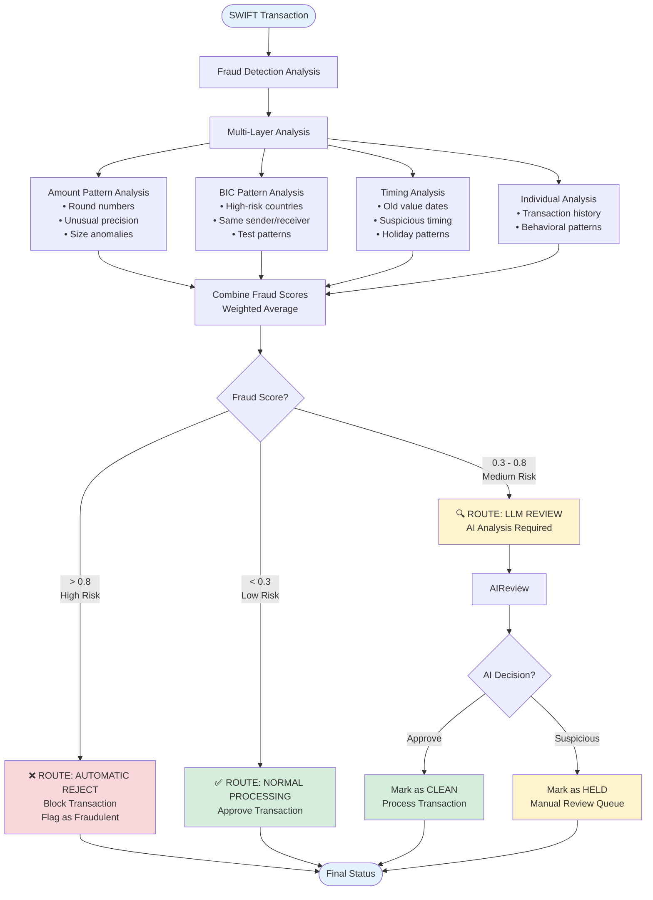
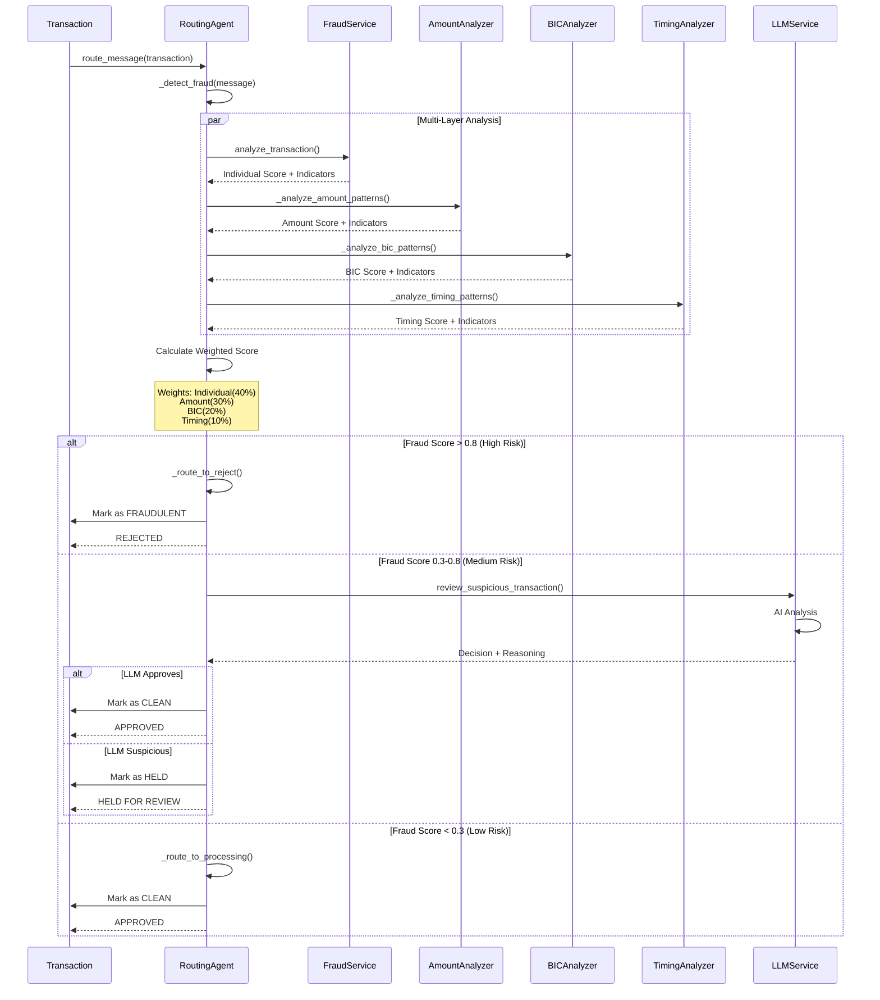
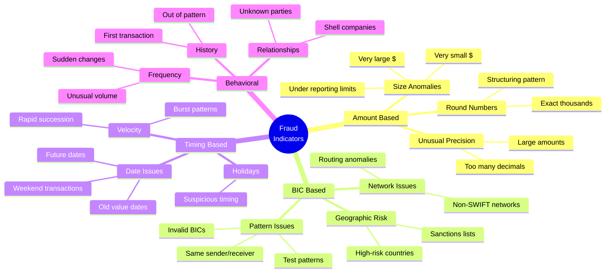

## Routing Flow Diagram

## Sequence Diagram - Routing Process

## Fraud Indicators by Category

## Fraud Detection Analysis Methods

### 1. Amount Pattern Analysis

**Checks:**
- ✓ Round number detection (structuring)
- ✓ Unusual precision for large amounts
- ✓ Suspiciously small amounts
- ✓ Very large transaction amounts

**Scoring:**
- Round amounts (≥$10k): +0.2
- Excessive decimals: +0.1
- Small amounts (<$100): +0.15
- Large amounts (>$1M): +0.25

### 2. BIC Pattern Analysis

**Checks:**
- ✓ High-risk country codes
- ✓ Identical sender/receiver BICs
- ✓ Test pattern detection (TEST, FAKE, DEMO)
- ✓ Invalid BIC formats

**Scoring:**
- High-risk country: +0.3 per BIC
- Same sender/receiver: +0.5
- Test patterns: +0.4 per occurrence

### 3. Timing Pattern Analysis

**Checks:**
- ✓ Value date validation
- ✓ Old transaction dates
- ✓ Weekend/holiday patterns
- ✓ Rapid transaction velocity

**Scoring:**
- Old dates (>30 days): +0.2
- Invalid date format: +0.1

### 4. Individual Transaction Analysis

**Checks:**
- ✓ Transaction history patterns
- ✓ Behavioral anomalies
- ✓ Known fraud patterns
- ✓ Statistical outliers

**Scoring:**
- Provided by FraudDetectionService
- Weighted at 40% in final score

## Routing Thresholds

| Fraud Score | Range | Decision | Action |
|-------------|-------|----------|--------|
| **Low Risk** | 0.0 - 0.3 | ✅ APPROVE | Route to normal processing |
| **Medium Risk** | 0.3 - 0.8 | 🔍 REVIEW | Route to LLM for AI analysis |
| **High Risk** | 0.8 - 1.0 | ❌ REJECT | Automatic rejection, block transaction |

