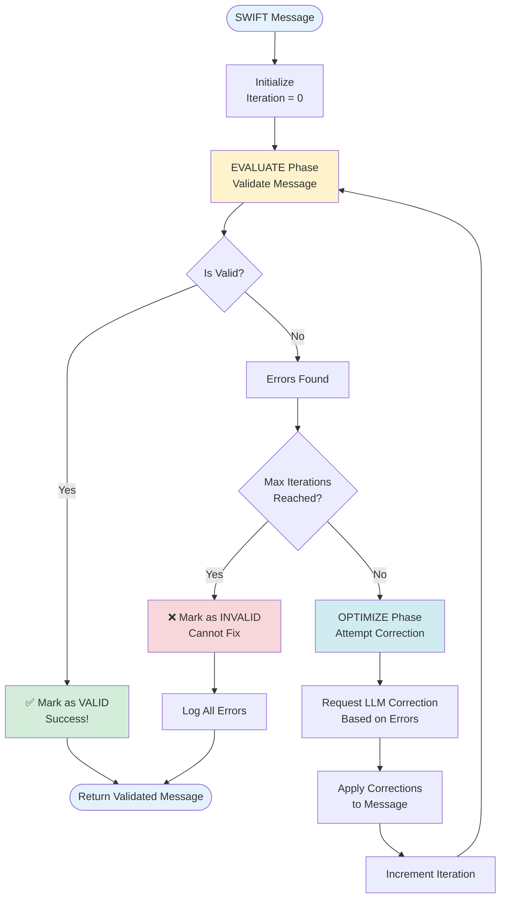
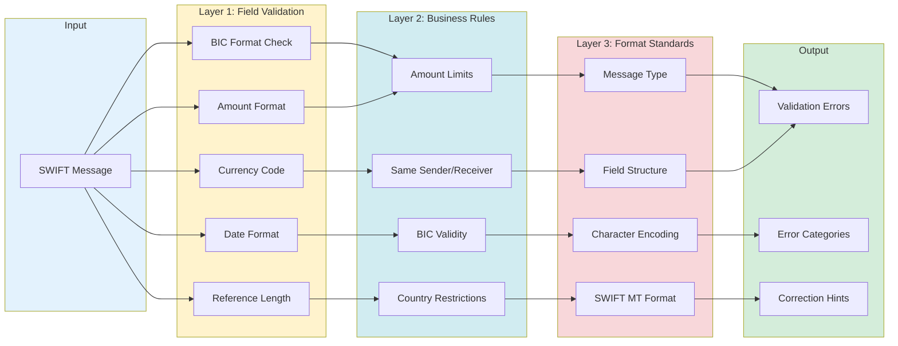
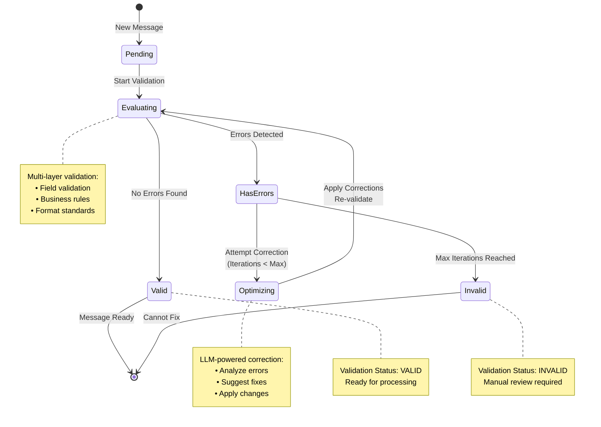

## Evaluator-Optimizer Flow




## Validation Layers



## State Machine - Message Status



## Validation Categories

### 1. Field Validation

**BIC Code Format:**
- Length: 8 or 11 characters
- Bank Code: 4 letters (positions 1-4)
- Country Code: 2 letters (positions 5-6)
- Location Code: 2 alphanumeric (positions 7-8)
- Branch Code: 3 alphanumeric (positions 9-11, optional)

**Amount Validation:**
- Valid decimal format
- Positive values only
- Within configured limits (min/max)

**Currency Code:**
- Exactly 3 letters
- ISO 4217 standard
- Alphabetic only

**Value Date:**
- YYMMDD format
- Exactly 6 digits
- Valid calendar date

**Reference:**
- Maximum 16 characters
- Alphanumeric only
- Unique identifier

### 2. Business Rules

**Amount Limits:**
```python
min_amount: 0.01       # Minimum transaction
max_amount: 10,000,000 # Maximum transaction
```

**BIC Restrictions:**
- Sender ≠ Receiver BIC
- Both BICs must be valid institutions
- Active SWIFT network members

**Message Type Support:**
- MT103 (Customer Transfer)
- MT202 (Bank Transfer)

### 3. Format Standards

**Message Type Validation:**
- Valid SWIFT MT format
- Supported message types only

**Structure Compliance:**
- Required fields present
- Correct field ordering
- Valid delimiters

**Character Encoding:**
- SWIFT character set
- No special characters
- Proper encoding

## Correction Strategy

### Error Type → Correction Action

| Error Type | Detection | Correction Strategy |
|-----------|-----------|---------------------|
| **Invalid BIC** | Format check fails | LLM suggests valid BIC from bank name/country |
| **Invalid Currency** | Length ≠ 3 or non-alpha | LLM infers from context (USD, EUR, GBP, etc.) |
| **Invalid Date** | Non-YYMMDD format | LLM converts to proper format |
| **Amount Out of Range** | < min or > max | LLM adjusts to boundary or suggests review |
| **Invalid Reference** | Special chars or too long | LLM sanitizes and truncates to 16 chars |
| **Same Sender/Receiver** | BIC codes match | LLM identifies correct receiver institution |


