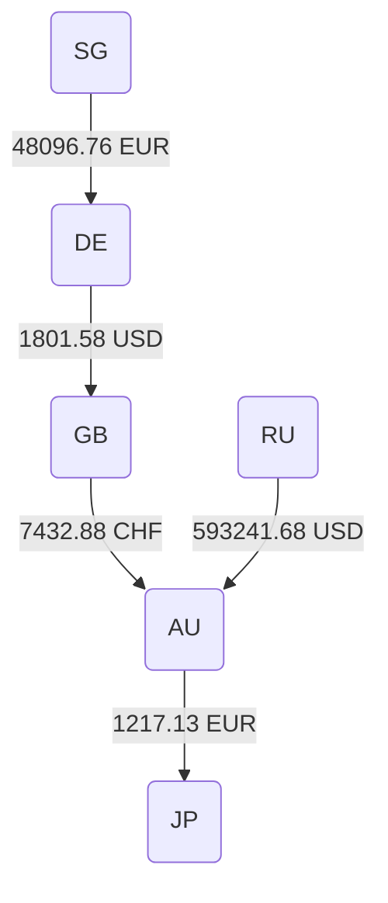
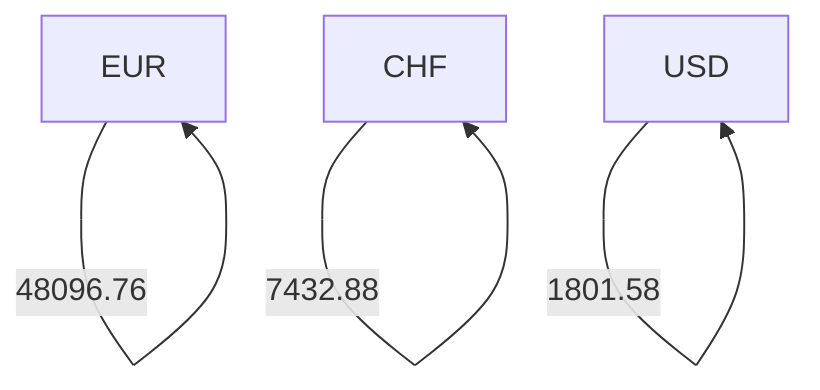
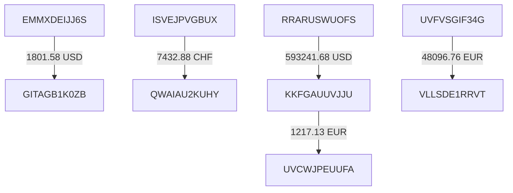

# SWIFT Money Flow Diagrams

This document contains flow diagrams illustrating the movement of money from the provided SWIFT messages. The diagrams include flows by country, currency, and BIC, and display the respective dollar amounts involved.

## 1. Country to Country Flow



## 2. Currency to Currency Flow



## 3. BIC to BIC Flow



### Explanation:

- **Country to Country Flow**: This diagram assumes the most likely countries for senders and receivers based on their BIC codes.
- **Currency to Currency Flow**: Displays the amounts for each transaction in its stated currency.
- **BIC to BIC Flow**: Tracks the actual path of funds between sending and receiving BICs, with dollar amounts specified.

Note: The actual countries associated with each BIC may vary depending on the financial institutions' registrations. In this demonstration, assumptions are made for illustrative purposes only.
```
