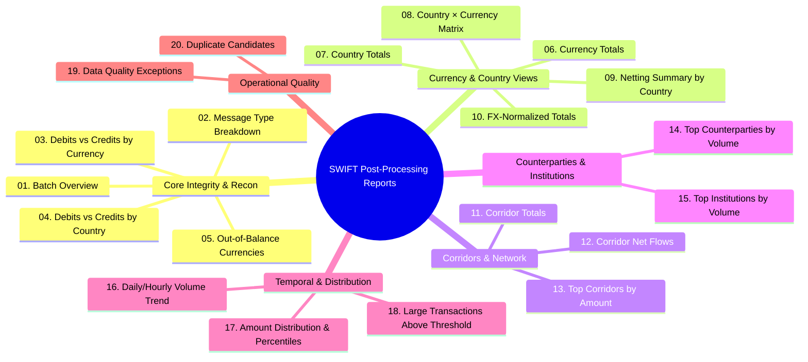

```mermaid
mindmap
  root((SWIFT Post-Processing Reports))
    Core Integrity & Recon
      01. Batch Overview 
      02. Message Type Breakdown 
      03. Debits vs Credits by Currency 
      04. Debits vs Credits by Country 
      05. Out-of-Balance Currencies 
    Currency & Country Views
      06. Currency Totals 
      07. Country Totals 
      08. Country × Currency Matrix 
      09. Netting Summary by Country 
      10. FX-Normalized Totals 
    Corridors & Network
      11. Corridor Totals 
      12. Corridor Net Flows 
      13. Top Corridors by Amount 
    Counterparties & Institutions
      14. Top Counterparties by Volume 
      15. Top Institutions by Volume
    Temporal & Distribution
      16. Daily/Hourly Volume Trend 
      17. Amount Distribution & Percentiles 
      18. Large Transactions Above Threshold 
    Operational Quality
      19. Data Quality Exceptions 
      20. Duplicate Candidates 


```
